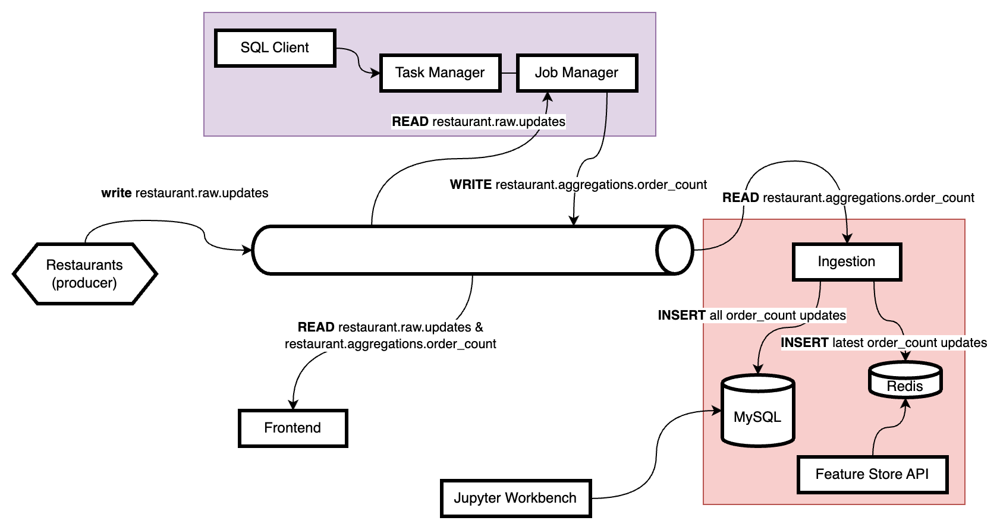

```bash
docker compose run flink-sql-client
```

```bash
docker compose up --build
```

## URLs

- Feature Store API: [http://localhost:8002](http://localhost:8002), for example: [http://localhost:8002/latest_count/1](http://localhost:8002/latest_count/1)
- Flink dashboard: [http://localhost:8081](http://localhost:8081)
- Frontend: [http://localhost:8000](http://localhost:8000)
- Workbench: [http://localhost:8888](http://localhost:8888)
- Redis: [http://localhost:8001](http://localhost:8001)
